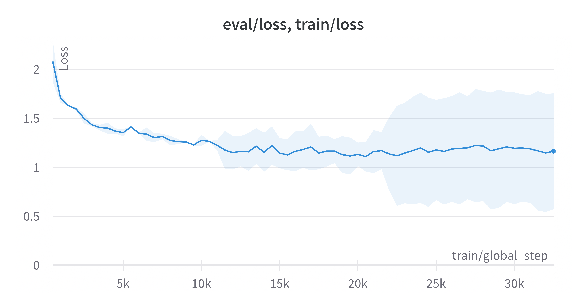

# :movie_camera: IMDB Genre Classification

<div align="center">

 

</div>

<br>

This is a project to classify movie genres based on the IMDB dataset. The dataset is available at [Kaggle](https://www.kaggle.com/datasets/hijest/genre-classification-dataset-imdb) by [@radmirkaz](https://www.kaggle.com/hijest).

Training and evaluation is done using [PyTorch](https://pytorch.org/). The model is a bert-based model, which is trained using [HuggingFace](https://huggingface.co/) transformers. The model is trained using [Kaggle](https://www.kaggle.com/) notebooks with 1x Tesla P100-PCIE-16GB GPU.

Used transfer learning to train the model on the IMDB dataset using pre-trained bert-base-uncased model which has 12 layers, 12 attention heads, 110M parameters. The model is trained for 3 epochs and the validation loss is 1.25 which is higher than other approaches on [kaggle](https://www.kaggle.com/datasets/hijest/genre-classification-dataset-imdb/code). The model is saved in the [model](./model) directory.

To track the training and evaluation, [Weights & Biases](https://wandb.ai/) is used. Check out below sections for the training and evaluation charts.

## Installation

In order to run the project, you need to install the dependencies. You can do this by running the following command:

```bash
pipenv install
```

## Usage

In order to run the project, you need to activate the virtual environment. You can do this by running the following command:

```bash
pipenv shell
```

Then you can run the following commands to infer from random descriptions in the test set:

```bash
python inference.py # for the inference
```

You can edit the `inference.py` file to change the number of random descriptions to infer from or you can define any description to infer from.

Here is an example of the inference:

```
>> python inference.py

ID: 38601

Description:
A young boy named James comes of age in 1940s
Louisiana and grapples with what it means to be
black during a time of racism and poverty. James's
mother accompanies her son to town to see about the
boy's nagging toothache, and his journey soon
becomes an eye-opening odyssey.

{
  'main_genre': 'drama',
  'probs': {
    'drama': 0.99215865,
    'thriller': 0.20301785,
    'adult': 0.094354086,
    'documentary': 0.8698041,
    'comedy': 0.9077166,
    'crime': 0.07586642,
    'reality-tv': 0.53746545,
    'horror': 0.10087363,
    'sport': 0.06306562,
    'animation': 0.5091429,
    'action': 0.14469174,
    'fantasy ': 0.29834923,
    'short ': 0.98818064,
    'sci-fi ': 0.11240034,
    'music ': 0.1928257,
    'adventure ': 0.48210135,
    'talk-show ': 0.11354283,
    'western ': 0.058112852,
    'family ': 0.9431392,
    'mystery ': 0.17680475,
    'history ': 0.15466228,
    'news ': 0.05059276,
    'biography ': 0.33000508,
    'romance ': 0.46325752,
    'game-show ': 0.043943904,
    'musical ': 0.3032691,
    'war ': 0.091459215
    },
  'other_genres': [
    'drama',
    'documentary',
    'comedy',
    'short',
    'family'
    ]
  }
Time taken in seconds: 0.2681879997253418 (CPU)
Ground truth:  documentary
```

:warning: **Note:** The sample description is taken from the test set randomly, so the ground truth might not be the same as the best label and it doesn't mean that the model is wrong or right.

Try [IPython](./docs/kaggle_train.ipynb) file for the training and evaluation.

## Training

The model is trained using [Kaggle](https://www.kaggle.com/) notebooks with 1x Tesla P100-PCIE-16GB GPU. The training and evaluation is done using [Weights & Biases](https://wandb.ai/) to track the training and evaluation. The training and evaluation charts are available below.



Global step: 20k has the lowest eval_loss while training loss is still decreasing. The model is saved at this step.

## Acknowledgements

- [@radmirkaz](https://www.kaggle.com/hijest) for the [original dataset](https://www.kaggle.com/datasets/hijest/genre-classification-dataset-imdb)

## Authors

<p>
  <a href="https://github.com/iboraham">
    
  </a>
  <a href="https://www.kaggle.com/onurserbetci">
    
  </a>
  <p>
</p>
